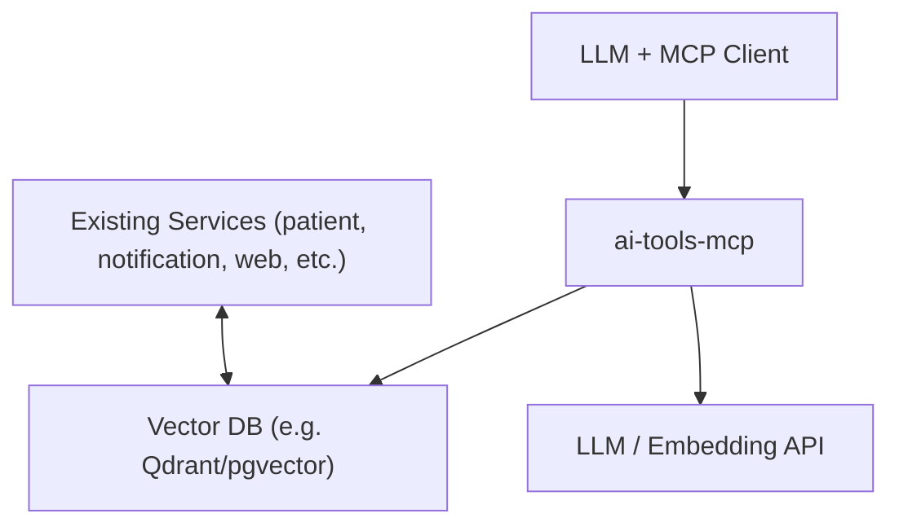

## MCP AI Tools Server – Detailed Implementation Plan

### 1. Goals & Overview

- **Goal**: Build and integrate a dedicated MCP server that provides AI-focused tools to LLMs, including:
  - A **vector database-backed store** for user data (semantic search, RAG).
  - Several **higher-level AI utilities** (summarization, RAG query, embeddings, etc.).
- **Non-goal**: Do *not* replace your existing microservices. The MCP server is an **auxiliary tool provider** used by the LLM; existing services remain the source of truth and handle business logic.

---

### 2. High-Level Architecture

- **New component**: `ai-tools-mcp` (MCP server process).
- **Interface**: MCP protocol over stdin/stdout (used by Cursor or other LLM clients).
- **Submodules**:
  - `mcp-server` core: handles JSON-RPC, tool dispatch.
  - `vectorstore`: abstraction layer over a concrete vector DB (e.g. Qdrant, pgvector).
  - `ai-client`: calls your LLM/embedding provider.
  - `tools`: individual MCP tools implementations (vector CRUD, RAG, etc.).
- **Data flow (conceptual)**:

---

### 3. Technology Choices

Pick one stack and stick to it for the MCP server:

- **Language**:
  - Go: good fit with existing project, strong performance, strong static typing.
  - TypeScript/Node: easier JSON handling, some existing MCP templates.
- **Vector DB options** (choose one):
  - **Qdrant** (self-hosted via Docker, or managed): Simple, well-documented, good HTTP/gRPC API.
  - **Weaviate**: Similar; more features, more complexity.
  - **Postgres + pgvector**: Leverage existing Postgres; consistent tooling, but you manage indexes & queries.
- **Embedding/LLM provider**:
  - Reuse whatever you already use (OpenAI, Gemini, Anthropic, etc.).
  - Ensure you have both: **embedding API** and **chat/completion API**.

**Action items:**

1. Decide language (Go or TS).
2. Decide vector DB (Qdrant vs pgvector, etc.).
3. Confirm which LLM/embedding provider to use and note required environment variables.

---

### 4. Repository Layout

Create a new directory at project root (names are suggestions):

- `mcps/ai-tools-mcp/`
  - `cmd/ai-tools-mcp/main.go` (or `src/index.ts`):
    - Sets up MCP server wiring and registers tools.
  - `internal/server/` (or `src/server/`):
    - JSON-RPC/MCP loop: read requests, route to tools, write responses.
    - Tool registry and dispatch.
  - `internal/vectorstore/`:
    - `client.go` / `client.ts`: connect to Qdrant/pgvector.
    - `store.go`: upsert/query/delete operations with typed interfaces.
  - `internal/ai/`:
    - `embeddings.go`: embedding client.
    - `llm.go`: chat/completion client.
  - `internal/tools/`:
    - `vector_upsert.go`, `vector_query.go`, `vector_delete.go`, `vector_list_collections.go`.
    - `ai_summarize.go`, `ai_rag_query.go`, `ai_embed.go`, etc.
  - `config/`:
    - `config.example.yaml` or `.env.example` describing required env vars.
  - `README.md` for this MCP server.

---

### 5. Data Model for Vector Store

Design a **generic** schema that can support multiple user-centric use cases.

**Core fields** (conceptual):

- `id`: string/UUID – document id.
- `user_id`: string – user/tenant owner.
- `collection`: logical group (e.g. `user_notes`, `sessions`, `support_docs`).
- `content`: string – raw text body.
- `embedding`: vector – stored in the vector DB.
- `metadata` (JSON-ish):
  - `source`: `"note" | "session" | "import" | ..."`
  - `tags`: list of strings.
  - `created_at`, `updated_at`: ISO8601 strings.
  - `sensitivity_level`: `"public" | "internal" | "private"` (optional).

**Action items:**

1. Write down the initial collections you want:
   - `user_notes` (freeform user data).
   - `call_transcripts` or `sessions` if you plan to store those.
2. For each collection, document expected metadata keys.

---

### 6. MCP Tool Definitions – Vector Operations

Design tool interfaces (names are illustrative; follow MCP’s JSON schema style).

#### 6.1 `vector.upsert`

- **Purpose**: Insert or update a document in a collection.
- **Input**:
  - `collection: string` (e.g. `"user_notes"`).
  - `user_id: string`.
  - `id?: string` (optional; if omitted, server generates one).
  - `content: string`.
  - `metadata?: object`.
- **Output**:
  - `{ id: string, collection: string, user_id: string }`.

**Behavior**:

1. Validate required fields.
2. Compute embedding for `content` via `ai/embeddings`.
3. Upsert into vector DB with fields + embedding.
4. Return the `id` and identifiers.

#### 6.2 `vector.query`

- **Purpose**: Semantic search over stored user data.
- **Input**:
  - `collection: string`.
  - `user_id: string`.
  - `query: string` (natural-language).
  - `top_k?: number` (default 5–10).
  - `score_threshold?: number` (0–1 or DB-specific).
  - `filters?: object` (metadata filters, e.g. `{ tags: ["diabetes"] }`).
- **Output**:
  - `results: Array<{ id, content, metadata, score }>`.

**Behavior**:

1. Embed `query`.
2. Query vector DB with filter `user_id` + any metadata filters.
3. Apply `score_threshold` if given.
4. Return ordered results.

#### 6.3 `vector.delete`

- **Purpose**: Delete documents.
- **Input**:
  - `collection: string`.
  - `user_id: string`.
  - One of:
    - `id: string`,
    - or `filter: { ... }` (e.g. delete all for `user_id` & `collection`).
- **Output**:
  - `{ deleted_count: number }`.

#### 6.4 `vector.listCollections`

- **Purpose**: Help the LLM know what’s available.
- **Output**:
  - `collections: Array<{ name, description, schemaSummary }>`.

---

### 7. MCP Tool Definitions – Higher-Level AI Tools

#### 7.1 `ai.summarize`

- **Purpose**: Summarize text(s) for various purposes.
- **Input**:
  - `text: string | string[]`.
  - `purpose?: "user-facing" | "internal" | "debug"` (default `"user-facing"`).
  - `target_length?: "short" | "medium" | "long"`.
- **Output**:
  - `{ summary: string, key_points?: string[] }`.

**Implementation notes**:

- Build a system prompt based on `purpose`.
- Use underlying LLM to generate summary.
- For multiple inputs, either:
  - concatenate and summarize as a whole, or
  - summarize each then produce an overall summary.

#### 7.2 `ai.embed`

- **Purpose**: Get raw embeddings for arbitrary text.
- **Input**:
  - `texts: string[]`.
- **Output**:
  - `{ vectors: number[][] }`.

**Use cases**: advanced workflows where the LLM wants to manage similarity logic itself.

#### 7.3 `ai.ragQuery`

- **Purpose**: One-shot RAG query over one or more collections.
- **Input**:
  - `user_id: string`.
  - `collections: string[]`.
  - `query: string`.
  - `top_k?: number` (for context).
  - `system_prompt?: string` (override/extend default system instructions).
- **Output**:
  - `{ answer: string, sources: Array<{ collection, id, snippet, score }> }`.

**Behavior**:

1. For each collection, call `vector.query` (or a unified multi-collection search).
2. Take top-k docs overall; build a prompt:
   - System: domain guidelines, safety, how to cite sources.
   - Context: `[DOC id:..., collection:...]\ncontent...`.
   - User: the original `query`.
3. Call LLM; return answer + linked sources (ids, snippets).

#### 7.4 Optional utility tools

- `ai.inspectUsage`:
  - Summarize tool usage over time (if you log metrics).
- `ai.redact`:
  - Redact PII from given text before storing in vector DB.

Keep these optional for later.

---

### 8. Security, Multi-Tenancy & Governance

#### 8.1 Tenant scoping

- **Rule**: All data operations must include `user_id` and filter by it.
- In vector DB:
  - Either:
    - embed `user_id` in metadata and always filter by it, or
    - use separate collections/partitions per user (less flexible; more overhead).

#### 8.2 Secret handling

- Define environment variables:
  - `VECTOR_DB_URL` / `VECTOR_DB_API_KEY`.
  - `EMBEDDING_API_KEY`, `LLM_API_KEY`.
- Provide `.env.example` for the MCP server directory.
- Do *not* log:
  - raw content for sensitive collections,
  - full prompts/responses for high-sensitivity data.

#### 8.3 Data deletion

- Consider a dedicated tool:
  - `vector.purgeUser`
    - `input`: `user_id`, optional `collections`.
    - `output`: `{ deleted_count }`.
- Ensure it fully removes both content and vectors.

#### 8.4 Protecting user data from the LLM

- **Principle**: Sensitive user data should never be sent to the LLM chat endpoint unless strictly necessary and explicitly allowed.
- **Separation of concerns**:
  - **Embeddings API**: sees raw text for vectorization (cannot be avoided for semantic search) but does not generate natural-language responses.
  - **Chat/Completion API**: only sees **redacted** and **minimized** context (no direct identifiers, no free-form PII).
- **Default rules**:
  - Mark each collection with a `sensitivity_level` and a `llm_visibility` flag, e.g.:
    - `llm_visibility: "none" | "redacted" | "full"`.
  - In `ai.ragQuery`:
    - Filter out collections with `llm_visibility: "none"` when building prompts.
    - For `llm_visibility: "redacted"`, run the redaction pipeline (see 8.5) on snippets before including them in prompts.
  - Never include raw `user_id`, phone, email, or other stable identifiers in LLM prompts; instead, use neutral placeholders (e.g. `"[USER]"`, `"[PHONE]"`).
- **Configurable policy**:
  - Expose a simple config (YAML/JSON) where you can declare, per-collection:
    - whether it is allowed in prompts at all,
    - which metadata fields may be shown (e.g. `created_at` ok, `mrn` not ok).

#### 8.5 Redaction pipeline (how redaction works)

- **Redaction module**:
  - Implement a small, reusable `redaction` package used by:
    - the `ai.redact` tool (if exposed),
    - internal flows before:
      - storing content in the vector DB (optional, depending on your needs),
      - sending context into `ai.ragQuery` prompts.
- **Detection strategies**:
  - **Rule-based detectors** for common identifiers:
    - Emails: regex like `\b[A-Z0-9._%+-]+@[A-Z0-9.-]+\.[A-Z]{2,}\b` (case-insensitive).
    - Phone numbers: regex for E.164 and local formats.
    - Dates of birth: date-like patterns, optionally cross-checked with age ranges.
    - IDs you know from your domain (MRNs, patient IDs, etc.).
  - Optional **dictionary/keyword-based** filters for particularly sensitive terms.
  - Optional **ML-based PII detection** later (wrap a provider like AWS Comprehend PII, Azure, etc.), but keep v1 rule-based for simplicity and determinism.
- **Redaction actions**:
  - Replace detected spans with stable placeholders:
    - `"john.doe@example.com"` → `"[EMAIL]"`.
    - `"318-555-1234"` → `"[PHONE]"`.
    - `"2001-01-01"` → `"[DATE]"`.
  - For IDs, either:
    - fully mask: `"123456"` → `"[ID]"`, or
    - partially mask if needed: `"PAT-123456"` → `"PAT-[ID]"`.
- **Storage vs. prompt redaction**:
  - **Option A (safer)**: Redact before storing in the vector DB → vectors are built from redacted text only.
  - **Option B (more fidelity)**: Store raw text in the vector DB, but *always*:
    - run redaction at query time before sending context to the LLM,
    - and restrict direct access to raw content to internal/admin flows.
  - The plan supports both; you pick based on your regulatory/compliance needs.

#### 8.6 Handling files (audio, txt, pdf) and redaction

- **File access strategy**:
  - The MCP server should not blindly read arbitrary filesystem paths from the LLM.
  - Instead, define **controlled file roots** (e.g. a `data/` directory or an object storage bucket) and expose tools that accept:
    - a logical file identifier (e.g. `file_id` or known path under those roots),
    - plus the `user_id` that owns the file.
- **Ingestion pipeline** (per file):
  1. **Locate & load**:
     - TXT/Markdown: read as text.
     - PDF: use a PDF text extractor (e.g. `pdftotext` or a Go/TS PDF lib).
     - Audio: run automatic speech-to-text (ASR) via an external service (e.g. Whisper/OpenAI) and obtain a transcript.
  2. **Chunking**:
     - Split long text into chunks (e.g. 512–1024 tokens or characters) with overlaps for better retrieval.
  3. **Redaction**:
     - Run the redaction pipeline (8.5) on each chunk.
     - Decide whether to:
       - store **only redacted** text in the vector DB, or
       - store raw text in primary storage (e.g. S3/Postgres) and redacted text in vector DB.
  4. **Vectorization & storage**:
     - For each (optionally redacted) chunk, compute embeddings and upsert via `vector.upsert` semantics:
       - `collection` might be `user_files` or more specific like `user_audio_transcripts`.
       - metadata includes `file_id`, `chunk_index`, `original_filename`, etc.
- **MCP tooling for files**:
  - `files.ingestAndIndex` (conceptual tool):
    - Input: `user_id`, `file_id`/path, `collection`, `redaction_policy`.
    - Behavior: run the above pipeline and return counts and summaries of what was indexed.

#### 8.7 Managing user context in this application

- **User identity**:
  - Treat `user_id` as the **canonical tenant key** in all MCP tools.
  - The MCP server does *not* authenticate end-users itself; it trusts the caller (Cursor/LLM host) to supply a correct `user_id` for each tool invocation.
  - In future, you can augment this with signed tokens or a small auth layer if needed.
- **Context boundary**:
  - All vector operations (`vector.*`, `ai.ragQuery`) must:
    - require `user_id` as input,
    - add `user_id` as a mandatory filter when querying the vector DB.
  - This ensures one user’s data is never surfaced as context for another user.
- **Session-level context (LLM side)**:
  - At the LLM prompt level, you can treat `user_id` as:
    - an **implicit parameter** passed in all MCP calls from that session, or
    - an explicit argument in each tool invocation (preferred for clarity and auditing).
- **Context management patterns**:
  - For each new LLM conversation:
    - Initialize with `user_id` and maybe high-level attributes (e.g. language, preferences) **without PII**.
    - Use `vector.query`/`ai.ragQuery` to pull in user-specific context as needed.
  - For long-running sessions:
    - Optionally store snippets of the conversation (after redaction) into a `user_sessions` collection via `vector.upsert`, so future queries can recall prior context without handing raw logs to the LLM again.
- **Configuration & observability**:
  - Add a simple `context_policy` configuration per environment that declares:
    - which collections are used for which types of queries,
    - maximum age of data to consider for context (e.g. last 30 days),
    - any caps on the number of docs per query.
  - Log `user_id` and collection names (but not content) with each tool call for debugging and for verifying isolation rules.

---

### 9. MCP Server Implementation Steps (Execution Order)

1. **Bootstrap server skeleton**
   - Set up a minimal main that:
     - Reads JSON-RPC/MCP messages from stdin.
     - Has a static registry of tools (e.g. `map[string]ToolHandler`).
     - Implements a simple `ping` or `echo` tool for smoke testing.
2. **Implement vectorstore client**
   - Add config struct with:
     - `URL`, `API key` (if applicable), `collection` naming conventions.
   - Implement:
     - `Init()` / `Connect()`.
     - `Upsert(doc)` → create/update.
     - `Query(queryVec, filters, topK)` → returns list.
     - `Delete(filter)`.
3. **Wire embeddings**
   - Add a small client that:
     - `Embed(text: string | string[]) → number[][]`.
   - Make this reusable across vector & AI tools.
4. **Implement `vector.*` tools**
   - Start with `vector.upsert` + `vector.query`:
     - Validate input.
     - Use embedding client and vectorstore client.
     - Convert DB results into clean tool outputs.
   - Then add `vector.delete` and `vector.listCollections`.
5. **Implement `ai.*` tools**
   - `ai.summarize`:
     - Build a template/system prompt based on `purpose`.
     - Call LLM client; return summary.
   - `ai.embed`:
     - Wrap embedding client.
   - `ai.ragQuery`:
     - Orchestrate `vector.query` + LLM call, return answer+sources.
6. **Add logging & basic error handling**
   - For each tool invocation, log:
     - Tool name, `user_id`, `collections`, latency, success/failure category.
   - Ensure that unexpected exceptions are captured and converted into MCP error format.
7. **Write tests**
   - Unit tests:
     - For vectorstore abstraction, using in-memory or test instance.
   - Integration tests:
     - Spin up local vector DB in CI (docker) and run a small upsert+query cycle.
     - Test `ai.ragQuery` with a mocked LLM client.

---

### 10. Integration with Cursor / LLM Client

1. **Register MCP server**
   - In Cursor (or your LLM environment), add a new MCP server entry, e.g.:
     - Command: `mcps/ai-tools-mcp/bin/ai-tools-mcp`
     - Environment:
       - `VECTOR_DB_URL`, `EMBEDDING_API_KEY`, `LLM_API_KEY`, etc.
2. **Tool naming and docs**
   - Document each tool (inputs, outputs, examples) in the MCP server’s `README.md`.
   - Optionally create prompt snippets/examples for using:
     - `vector.query` for semantic lookup.
     - `ai.ragQuery` for domain-knowledge Q&A.
3. **Usage patterns**
   - Decide how you want the LLM to use this MCP:
     - For **patient context**: call `vector.query` on `user_notes` and `sessions`.
     - For **developer context**: search logs/notes stored in another collection.
   - Add a `USAGE.md` with concrete usage flows.

---

### 11. Rollout & Future Enhancements

- **Phase 1 (dev-only)**:
  - Run MCP server locally with a local vector DB instance.
  - Confirm tools work by manual calls from the LLM/IDE.
- **Phase 2 (internal use)**:
  - Deploy vector DB + MCP server into your dev cluster.
  - Use it only from your own Cursor configuration.
- **Phase 3 (production)**:
  - Harden security (network ACLs, auth).
  - Add metrics/alerts for failures and latency.
  - Optionally implement:
    - Rate limiting per `user_id` for `ai.ragQuery`.
    - A small audit log of tool usage (without storing full content).

---

### 12. Checklist

You can treat this as a TODO list:

- [ ] Choose stack: language, vector DB, LLM provider.
- [ ] Create `mcps/ai-tools-mcp` directory and basic MCP server skeleton.
- [ ] Implement `vectorstore` abstraction and connect to chosen DB.
- [ ] Implement `ai/embeddings` and `ai/llm` clients.
- [ ] Implement `vector.upsert`, `vector.query`, `vector.delete`, `vector.listCollections`.
- [ ] Implement `ai.summarize`, `ai.embed`, `ai.ragQuery`.
- [ ] Add logging and minimal tests.
- [ ] Document environment variables and MCP registration steps.
- [ ] Wire into Cursor / your LLM config and test end-to-end.

