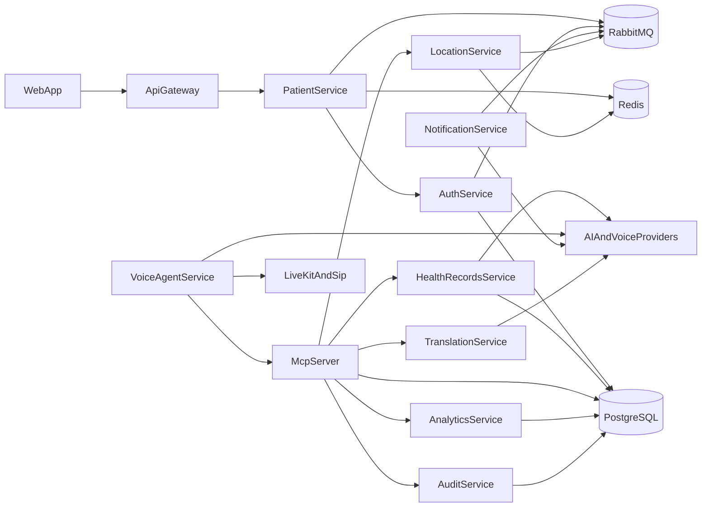
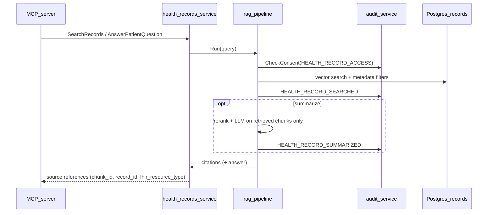

# Architecture

Zorba Health is a voice-oriented healthcare AI platform composed of Go microservices, a Next.js frontend, gRPC service-to-service communication, RabbitMQ for events, PostgreSQL for durable data, Redis for short-lived state, and external voice and AI providers.

This document reflects the current repository as implemented today and calls out the most important future-work areas explicitly.

## Canonical repo root

The repository root is the canonical workspace root for application code and build tooling. See [`docs/directory-map.md`](directory-map.md) for the full layout.

## High-level container view

## Current service boundaries

### API Gateway

- HTTP entrypoint for the web app and public API surface
- Now routes patient authentication, self-service patient portal endpoints, and hospital-facing summary and incident endpoints

### Auth Service

- Account and token-related gRPC functionality
- Consumes patient lifecycle events from RabbitMQ
- Uses PostgreSQL for durable auth state

### Patient Service

- Patient registration and verification flows
- Uses PostgreSQL for durable patient records
- Uses Redis for pending registration and OTP-like temporary state
- Publishes patient events to RabbitMQ

### Health Records Service

- Health-record retrieval, storage, embeddings, and summarization entrypoint
- Uses PostgreSQL and OpenAI-backed adapters in the current implementation
- Owns the current health record storage and retrieval boundary

### MCP Server

- Tool gateway exposed over MCP stdio
- Calls health records, translation, location, and analytics over gRPC
- Calls audit-service for consent and append-only audit events
- Uses PostgreSQL directly for legacy compatibility during migration

### Audit Service

- Dedicated gRPC service for append-only audit events and consent records
- Owns the `audit` PostgreSQL schema
- Provides the current compliance boundary for MCP and future auditor-facing queries

### Voice Agent Service

- LiveKit Agents-based voice runtime and webhook receiver
- Owns realtime STT, LLM, TTS, VAD, and turn handling
- Calls MCP over HTTP for backend tools and receives LiveKit webhook callbacks on its own HTTP endpoint
- Owns the current safety and emergency-escalation trigger logic because the old Go worker service was removed

### Notification Service

- RabbitMQ consumer for patient-related events
- Sends email and SMS in the current implementation
- Also exposes an HTTP webhook endpoint for VoIP.ms SMS integration
- Also consumes emergency escalation events for urgent SMS fan-out

### Location Service

- gRPC location lookup and nearest-hospital access
- HTTP WebSocket endpoint for session updates
- Uses Redis for short-lived location/session state
- Uses a provider-backed nearest-hospital finder with seeded fallback results for local demos

### Translation Service

- gRPC translation service
- Currently backed by a translation-model HTTP dependency

### Analytics Service

- gRPC analytics service backed by PostgreSQL
- Separate from the desired future audit/compliance boundary

### Health Provider Service

- Intended provider and organization surface
- Present in the repository, but currently only a stub HTTP service with no real handlers

## Data and communication patterns

### Synchronous paths

- Web -> API Gateway -> gRPC backend services
- Voice Agent Service -> MCP Server -> gRPC backend services
- MCP Server -> gRPC services

### Asynchronous paths

- Patient lifecycle events -> RabbitMQ -> Auth and Notification services
- Location service also consumes call-related events through RabbitMQ
- Emergency escalation events -> RabbitMQ -> Notification service

### Short-lived versus durable state

- PostgreSQL stores durable service data
- Redis stores temporary session and registration state
- RabbitMQ carries cross-service event notifications

## Existing implementation notes

- Local development is currently optimized for `tilt up` from the repository root
- Existing architecture flow documents live under `docs/architecture/`
- Voice and SIP infrastructure are expected to run outside the local in-repo stack
- The current web app now includes a patient home under `web/src/app/patient/page.tsx`
- The current hospital web surface now includes an emergency inbox and patient audit panel

## Health records service vs RAG module

| Concern | Owner | Package / schema |
| --- | --- | --- |
| FHIR resource storage, patient linkage, access control metadata | Health records service | `internal/adapters/.../postgres`, schema `records.fhir_*` |
| FHIR validation, normalization, bundle ingestion | FHIR adapter module | `services/health-records-service/internal/fhir/` |
| Chunking, embeddings, vector search, rerank, grounded summarization | RAG module | `services/health-records-service/internal/rag/` |
| MCP / voice exposure | MCP server + voice agent | Returns citations and summaries, not raw FHIR JSON by default |

Import rules:

- `internal/rag` may depend on outbound ports and `internal/rag/chunker` only (not gRPC handlers).
- `internal/fhir` may depend on outbound ports and `internal/rag/chunker` for indexing.
- gRPC adapters (`internal/adapters/primary`) orchestrate inbound calls but do not embed provider SDKs directly.

See also [`services/health-records-service/README.md`](../services/health-records-service/README.md) and [`docs/pgvector-indexing.md`](pgvector-indexing.md).

## Future work

The following roadmap items are intentionally documented here so contributors can distinguish implemented behavior from planned architecture:

- Provider abstraction interfaces for LLM, embeddings, STT, TTS, email, SMS, telephony, translation, vector search, and FHIR
- Stronger MCP gateway enforcement for auth, consent, scope, and audit wrapping
- OpenTelemetry coverage across every service
- mTLS and stronger internal service identity
- Docker Compose and Helm packaging
- Q1 journal evaluation harness and reproducibility scripts

## Related implementation documents

- [`service-map.md`](service-map.md)
- [`local-setup.md`](local-setup.md)
- [`kubernetes-setup.md`](kubernetes-setup.md)
- [`security.md`](security.md)
- [`compliance.md`](compliance.md)
