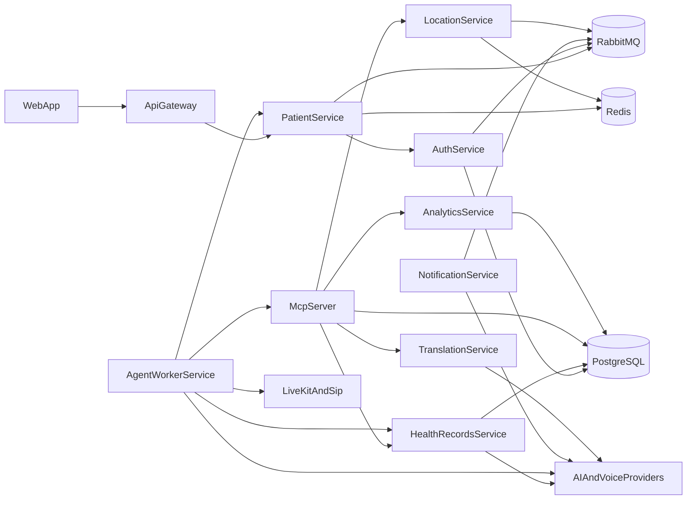

# Architecture

Zorba Health is a voice-oriented healthcare AI platform composed of Go microservices, a Next.js frontend, gRPC service-to-service communication, RabbitMQ for events, PostgreSQL for durable data, Redis for short-lived state, and external voice and AI providers.

This document reflects the current repository as implemented today and calls out the most important future-work areas explicitly.

## Canonical repo root

The repository root is the canonical workspace root for application code and build tooling. See [`docs/directory-map.md`](directory-map.md) for the full layout.

## High-level container view

## Current service boundaries

### API Gateway

- HTTP entrypoint for the web app and public API surface
- Today it mainly routes patient authentication and registration requests

### Auth Service

- Account and token-related gRPC functionality
- Consumes patient lifecycle events from RabbitMQ
- Uses PostgreSQL for durable auth state

### Patient Service

- Patient registration and verification flows
- Uses PostgreSQL for durable patient records
- Uses Redis for pending registration and OTP-like temporary state
- Publishes patient events to RabbitMQ

### Health Records Service

- Health-record retrieval, storage, embeddings, and summarization entrypoint
- Uses PostgreSQL and OpenAI-backed adapters in the current implementation
- Owns the current health record storage and retrieval boundary

### MCP Server

- Tool gateway exposed over MCP stdio
- Calls health records, translation, location, and analytics over gRPC
- Uses PostgreSQL directly for some tool-related data access today

### Agent Worker Service

- Voice-session orchestration and LiveKit webhook handling
- Coordinates patient lookup, health-record access, MCP tool calls, and AI providers
- Currently wires Deepgram, OpenAI, ElevenLabs, and LiveKit-specific adapters directly

### Notification Service

- RabbitMQ consumer for patient-related events
- Sends email and SMS in the current implementation
- Also exposes an HTTP webhook endpoint for VoIP.ms SMS integration

### Location Service

- gRPC location lookup and nearest-hospital access
- HTTP WebSocket endpoint for session updates
- Uses Redis for short-lived location/session state

### Translation Service

- gRPC translation service
- Currently backed by a translation-model HTTP dependency

### Analytics Service

- gRPC analytics service backed by PostgreSQL
- Separate from the desired future audit/compliance boundary

### Health Provider Service

- Intended provider and organization surface
- Present in the repository, but currently only a stub HTTP service with no real handlers

## Data and communication patterns

### Synchronous paths

- Web -> API Gateway -> gRPC backend services
- Agent Worker -> gRPC services
- MCP Server -> gRPC services

### Asynchronous paths

- Patient lifecycle events -> RabbitMQ -> Auth and Notification services
- Location service also consumes call-related events through RabbitMQ

### Short-lived versus durable state

- PostgreSQL stores durable service data
- Redis stores temporary session and registration state
- RabbitMQ carries cross-service event notifications

## Existing implementation notes

- Local development is currently optimized for `tilt up` from the repository root
- Existing architecture flow documents live under `docs/architecture/`
- Voice and SIP infrastructure are expected to run outside the local in-repo stack

## Future work

The following roadmap items are intentionally documented here so contributors can distinguish implemented behavior from planned architecture:

- Dedicated `audit-service` for append-only compliance logging
- Consent management with patient-scoped policy checks
- Provider abstraction interfaces for LLM, embeddings, STT, TTS, email, SMS, telephony, translation, vector search, and FHIR
- Stronger MCP gateway enforcement for auth, consent, scope, and audit wrapping
- FHIR-first ingestion and normalization boundary
- pgvector-backed RAG pipeline with source-grounded summaries
- OpenTelemetry coverage across every service
- mTLS and stronger internal service identity
- Docker Compose and Helm packaging
- Q1 journal evaluation harness and reproducibility scripts

## Related implementation documents

- [`service-map.md`](service-map.md)
- [`local-setup.md`](local-setup.md)
- [`kubernetes-setup.md`](kubernetes-setup.md)
- [`security.md`](security.md)
- [`compliance.md`](compliance.md)
