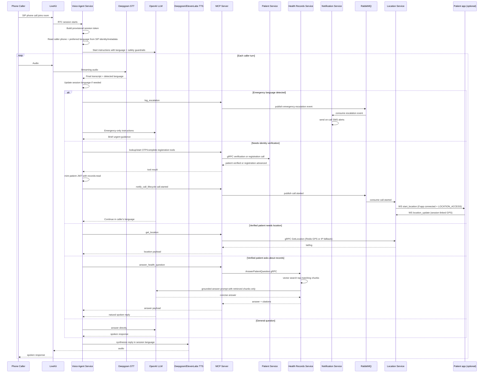
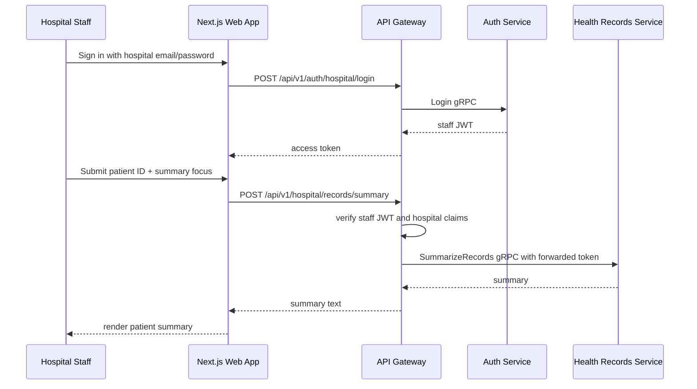

# Voice Call Flow - Current Agentic Workflows

This document reflects the current voice-agent architecture after the workflow implementation pass. The voice agent now relies on MCP-backed tools for patient verification, emergency escalation, and grounded health-record answers, while hospital staff use the web app for record summaries.

## Patient Voice Session

## Staff Summary Workflow

## Notes

- Multilingual behavior starts from SIP participant metadata when present and falls back to transcript language detection.
- Emergency handling is per final transcript turn, not just room setup time.
- Record access requires verified patient identity and a scoped patient JWT.
- Grounded patient Q&A and staff summaries are separate flows with separate actor permissions.
