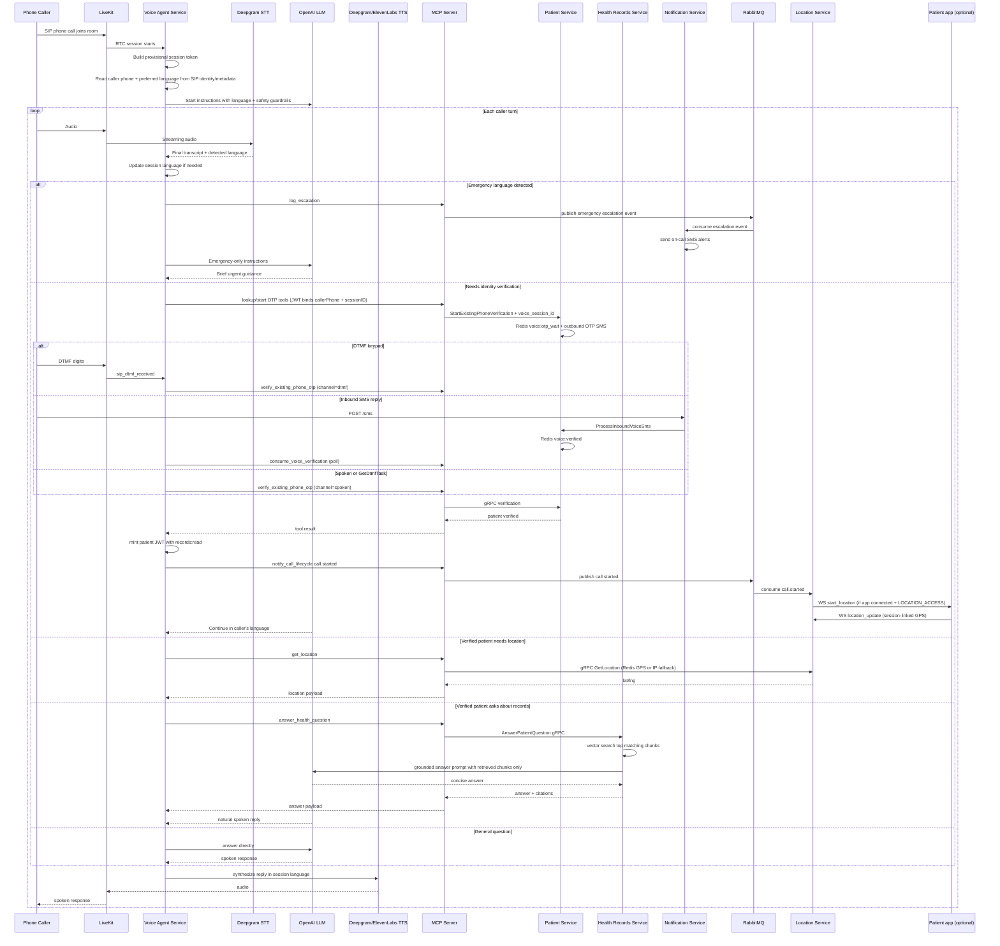
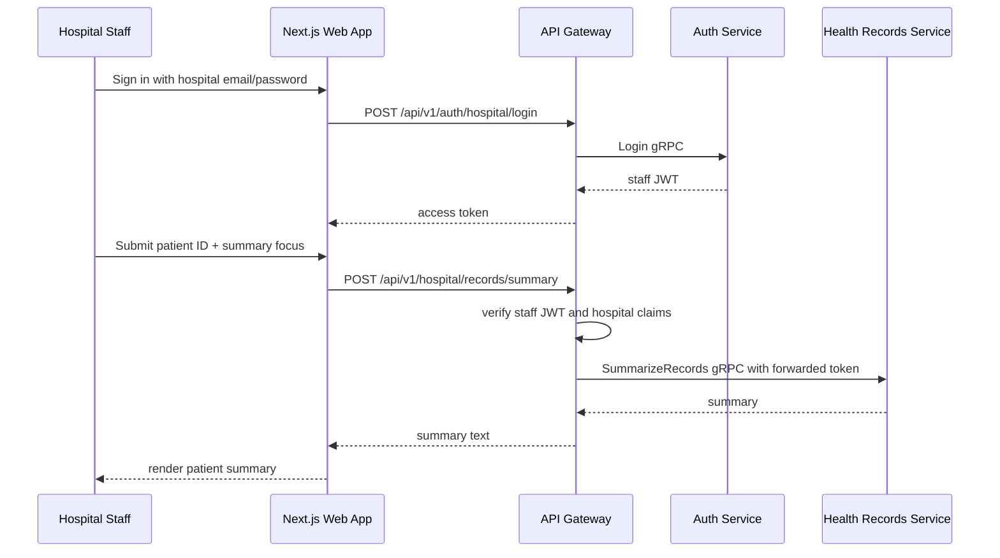
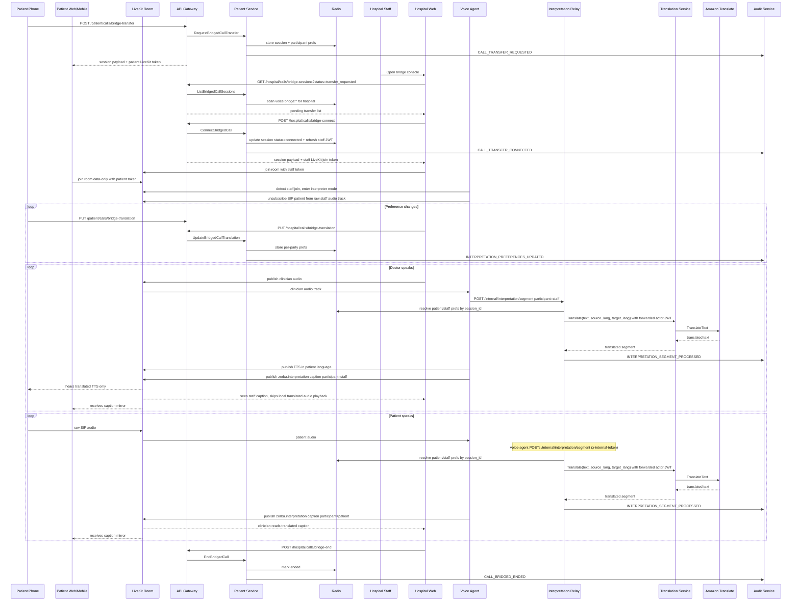

# Voice Call Flow - Current Agentic Workflows

This document reflects the current voice-agent architecture after the workflow implementation pass. The voice agent now relies on MCP-backed tools for patient verification, emergency escalation, and grounded health-record answers, while hospital staff use the web app for record summaries.

## Patient Voice Session

## Staff Summary Workflow

## Bridged Patient-Staff Interpretation

## Notes

- Multilingual behavior starts from SIP participant metadata when present and falls back to transcript language detection.
- Interpreter mode suppresses the normal conversational LLM flow while the clinician is connected; patient turns are relayed for captions instead of answered by Zorba.
- Staff audio is translated with STT -> translation -> TTS, while patient companion surfaces join the same room data-only for caption/status mirroring.
- Emergency handling is per final transcript turn, not just room setup time.
- Record access requires verified patient identity and a scoped patient JWT.
- Grounded patient Q&A and staff summaries are separate flows with separate actor permissions.
- Bridged patient-staff calls now persist a session-scoped translation model in Redis so patient and staff preferences can be updated independently during a live consult.
- The translation backend is now provider-switched and can use Amazon Translate without the legacy local `translation-model` deployment.
- The interpretation relay requires `x-internal-token` (`INTERNAL_SERVICE_SECRET`) and serves the producer in voice-agent-service (`INTERPRETATION_SERVICE_URL`). Passthrough rules are documented in `services/interpretation-service/README.md`.
- Bridge ops re-stamp the calling actor's JWT in Redis (transfer/connect/preference updates) so long consults keep a fresh token; ending a bridge clears stored JWTs and shortens the key TTL.
- The Redis session schema is shared via `shared/bridge` so patient-service (writer) and interpretation-service (reader) cannot drift.
