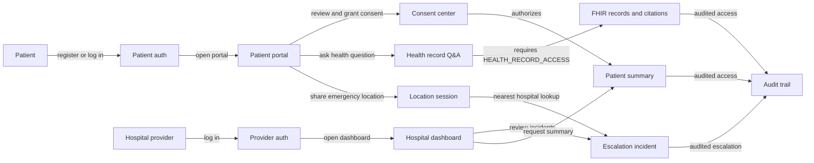

# Patient and Provider Workflow

This workflow is the current UX and security target for the local demo path.

## UX Requirements

- Patient workflows must make consent status visible before record Q&A and provider summaries depend on it.
- Provider workflows must separate incident review, patient summary, and patient audit lookup so staff can understand why an action is denied.
- Emergency location sharing must be explicit, session scoped, and revocable by ending the location session.

## Security Requirements

- Patient portal calls require patient tokens.
- Hospital workflows require staff tokens with a hospital identifier.
- Record Q&A and provider summaries require consent-gated access.
- Audit events should exist for successful and denied PHI-sensitive access.
- Incident metadata shown in provider views should stay PHI-minimal by default.
