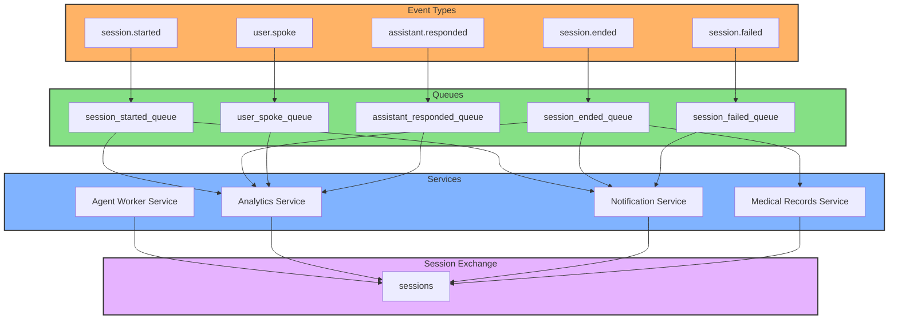

# RabbitMQ Event Flow - Basic Architecture

This diagram shows the basic RabbitMQ event flow architecture for the Health AI Voice Assistant system.

```mermaid
graph TD
    subgraph Exchange[Session Exchange]
        SE[sessions]
    end

    subgraph Queues
        Q1[session_started_queue]
        Q2[session_ended_queue]
        Q3[session_failed_queue]
        Q4[user_spoke_queue]
        Q5[assistant_responded_queue]
    end

    subgraph Events[Event Types]
        E1[session.started]
        E2[session.ended]
        E3[session.failed]
        E4[user.spoke]
        E5[assistant.responded]
    end

    subgraph Services
        AWS[Agent Worker Service]
        AS[Analytics Service]
        NS[Notification Service]
        MRS[Medical Records Service]
    end

    %% Event Flow
    E1 --> Q1
    E2 --> Q2
    E3 --> Q3
    E4 --> Q4
    E5 --> Q5

    %% Service Interactions
    AWS --> SE
    AS --> SE
    NS --> SE
    MRS --> SE

    %% Queue to Service Flow
    Q1 --> AS
    Q1 --> NS
    Q2 --> MRS
    Q2 --> AS
    Q2 --> NS
    Q3 --> NS
    Q4 --> AS
    Q5 --> AS

    style Exchange fill:#e6b3ff,stroke:#333,stroke-width:2px
    style Services fill:#80b3ff,stroke:#333,stroke-width:2px
    style Events fill:#ffb366,stroke:#333,stroke-width:2px
    style Queues fill:#85e085,stroke:#333,stroke-width:2px
```
