# RabbitMQ Event Flow - Complete Architecture

This diagram shows the complete RabbitMQ event flow architecture including all exchanges, queues, events, and service interactions.

```mermaid
graph TD
    subgraph Exchanges
        SE[Session Exchange]
        PE[Patient Exchange]
        MRE[Medical Records Exchange]
    end

    subgraph Queues[Queues]
        Q1[session_started_queue]
        Q2[session_ended_queue]
        Q3[session_failed_queue]
        Q4[user_spoke_queue]
        Q5[assistant_responded_queue]
        Q6[patient_registered_queue]
        Q7[patient_updated_queue]
        Q8[medical_record_created_queue]
        Q9[call_transcript_saved_queue]
    end

    subgraph Events[Event Types]
        E1[session.started]
        E2[session.ended]
        E3[session.failed]
        E4[user.spoke]
        E5[assistant.responded]
        E6[patient.registered]
        E7[patient.updated]
        E8[medical_record.created]
        E9[call_transcript.saved]
    end

    subgraph Services
        AWS[Agent Worker Service]
        PS[Patient Service]
        RS[RAG Service]
        MRS[Medical Records Service]
        AS[Analytics Service]
        NS[Notification Service]
    end

    %% Event Flow - Session Exchange
    E1 --> Q1
    E2 --> Q2
    E3 --> Q3
    E4 --> Q4
    E5 --> Q5

    %% Event Flow - Patient Exchange
    E6 --> Q6
    E7 --> Q7

    %% Event Flow - Medical Records Exchange
    E8 --> Q8
    E9 --> Q9

    %% Service Interactions - Publishing
    AWS --> SE
    PS --> PE
    MRS --> MRE

    %% Service Interactions - Consuming
    AS --> SE
    AS --> PE
    AS --> MRE
    NS --> SE
    NS --> PE
    MRS --> SE

    %% Queue to Service Flow - Session Events
    Q1 --> AS
    Q1 --> NS
    Q2 --> MRS
    Q2 --> AS
    Q2 --> NS
    Q3 --> NS
    Q4 --> AS
    Q5 --> AS

    %% Queue to Service Flow - Patient Events
    Q6 --> AS
    Q6 --> NS
    Q7 --> AS

    %% Queue to Service Flow - Medical Records Events
    Q8 --> AS
    Q8 --> NS
    Q9 --> AS

    style Exchanges fill:#e6b3ff,stroke:#333,stroke-width:2px
    style Services fill:#80b3ff,stroke:#333,stroke-width:2px
    style Events fill:#ffb366,stroke:#333,stroke-width:2px
    style Queues fill:#85e085,stroke:#333,stroke-width:2px
```

## Event Descriptions

### Session Exchange Events

- **session.started**: Published when a voice call session begins
- **session.ended**: Published when a voice call session completes (includes summary)
- **session.failed**: Published when a session encounters an error
- **user.spoke**: Published when user speech is transcribed
- **assistant.responded**: Published when AI generates a response

### Patient Exchange Events

- **patient.registered**: Published when a new patient registers
- **patient.updated**: Published when patient information is updated

### Medical Records Exchange Events

- **medical_record.created**: Published when a new medical record is created
- **call_transcript.saved**: Published when a call transcript is saved to medical records
