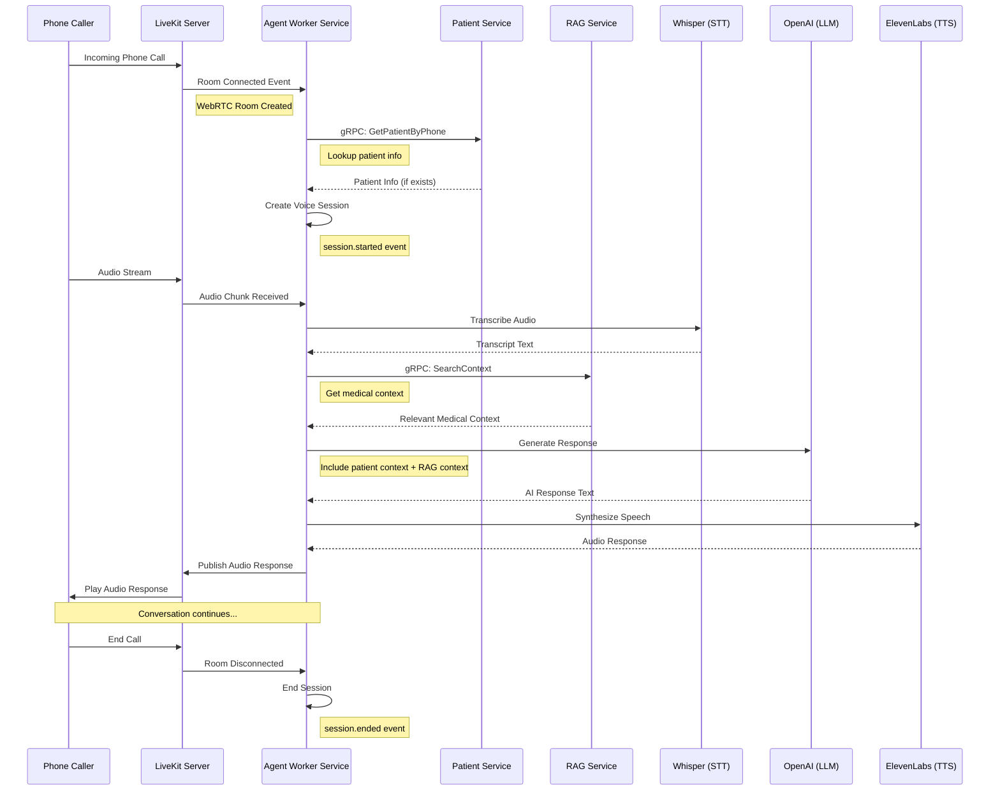

# Voice Call Flow - Basic Flow

This diagram shows the basic flow of a voice call through the Health AI Voice Assistant system.

```mermaid
sequenceDiagram
    participant Caller as Phone Caller
    participant LiveKit as LiveKit Server
    participant AgentWorker as Agent Worker Service
    participant PatientService as Patient Service
    participant RAGService as RAG Service
    participant STT as Whisper (STT)
    participant LLM as OpenAI (LLM)
    participant TTS as ElevenLabs (TTS)

    Caller->>LiveKit: Incoming Phone Call
    LiveKit->>AgentWorker: Room Connected Event
    Note right of LiveKit: WebRTC Room Created

    AgentWorker->>PatientService: gRPC: GetPatientByPhone
    Note right of AgentWorker: Lookup patient info

    PatientService-->>AgentWorker: Patient Info (if exists)
    AgentWorker->>AgentWorker: Create Voice Session
    Note right of AgentWorker: session.started event

    Caller->>LiveKit: Audio Stream
    LiveKit->>AgentWorker: Audio Chunk Received

    AgentWorker->>STT: Transcribe Audio
    STT-->>AgentWorker: Transcript Text

    AgentWorker->>RAGService: gRPC: SearchContext
    Note right of AgentWorker: Get medical context
    RAGService-->>AgentWorker: Relevant Medical Context

    AgentWorker->>LLM: Generate Response
    Note right of AgentWorker: Include patient context + RAG context
    LLM-->>AgentWorker: AI Response Text

    AgentWorker->>TTS: Synthesize Speech
    TTS-->>AgentWorker: Audio Response

    AgentWorker->>LiveKit: Publish Audio Response
    LiveKit->>Caller: Play Audio Response

    Note over Caller,AgentWorker: Conversation continues...

    Caller->>LiveKit: End Call
    LiveKit->>AgentWorker: Room Disconnected
    AgentWorker->>AgentWorker: End Session
    Note right of AgentWorker: session.ended event
```
