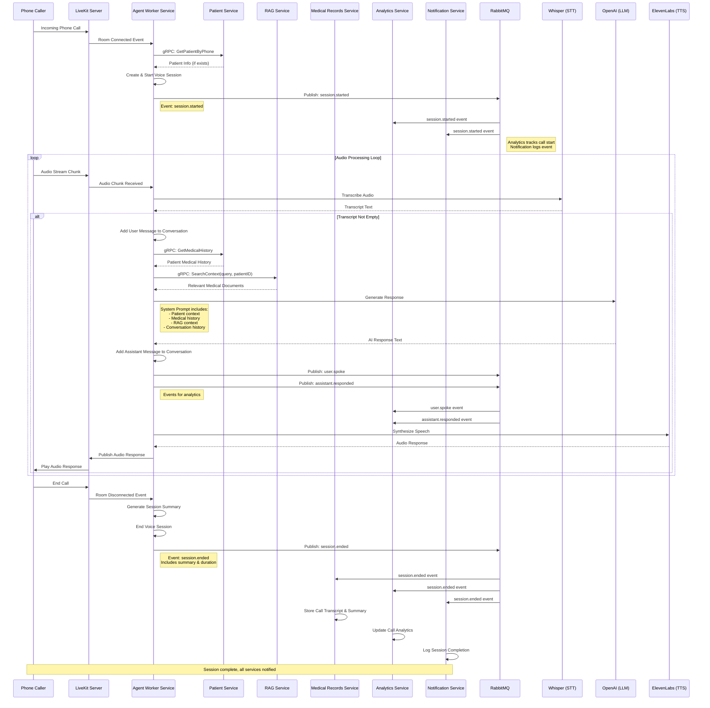

# Voice Call Flow - Complete Flow with Events

This diagram shows the complete voice call flow including event publishing, medical records updates, analytics, and notifications.

```mermaid
sequenceDiagram
    participant Caller as Phone Caller
    participant LiveKit as LiveKit Server
    participant AgentWorker as Agent Worker Service
    participant PatientService as Patient Service
    participant RAGService as RAG Service
    participant MedicalRecords as Medical Records Service
    participant Analytics as Analytics Service
    participant Notification as Notification Service
    participant RabbitMQ as RabbitMQ
    participant STT as Whisper (STT)
    participant LLM as OpenAI (LLM)
    participant TTS as ElevenLabs (TTS)

    Caller->>LiveKit: Incoming Phone Call
    LiveKit->>AgentWorker: Room Connected Event

    AgentWorker->>PatientService: gRPC: GetPatientByPhone
    PatientService-->>AgentWorker: Patient Info (if exists)

    AgentWorker->>AgentWorker: Create & Start Voice Session
    AgentWorker->>RabbitMQ: Publish: session.started
    Note right of AgentWorker: Event: session.started

    RabbitMQ->>Analytics: session.started event
    RabbitMQ->>Notification: session.started event
    Note right of RabbitMQ: Analytics tracks call start<br/>Notification logs event

    loop Audio Processing Loop
        Caller->>LiveKit: Audio Stream Chunk
        LiveKit->>AgentWorker: Audio Chunk Received

        AgentWorker->>STT: Transcribe Audio
        STT-->>AgentWorker: Transcript Text

        alt Transcript Not Empty
            AgentWorker->>AgentWorker: Add User Message to Conversation

            AgentWorker->>PatientService: gRPC: GetMedicalHistory
            PatientService-->>AgentWorker: Patient Medical History

            AgentWorker->>RAGService: gRPC: SearchContext(query, patientID)
            RAGService-->>AgentWorker: Relevant Medical Documents

            AgentWorker->>LLM: Generate Response
            Note right of AgentWorker: System Prompt includes:<br/>- Patient context<br/>- Medical history<br/>- RAG context<br/>- Conversation history
            LLM-->>AgentWorker: AI Response Text

            AgentWorker->>AgentWorker: Add Assistant Message to Conversation
            AgentWorker->>RabbitMQ: Publish: user.spoke
            AgentWorker->>RabbitMQ: Publish: assistant.responded
            Note right of AgentWorker: Events for analytics

            RabbitMQ->>Analytics: user.spoke event
            RabbitMQ->>Analytics: assistant.responded event

            AgentWorker->>TTS: Synthesize Speech
            TTS-->>AgentWorker: Audio Response

            AgentWorker->>LiveKit: Publish Audio Response
            LiveKit->>Caller: Play Audio Response
        end
    end

    Caller->>LiveKit: End Call
    LiveKit->>AgentWorker: Room Disconnected Event

    AgentWorker->>AgentWorker: Generate Session Summary
    AgentWorker->>AgentWorker: End Voice Session
    AgentWorker->>RabbitMQ: Publish: session.ended
    Note right of AgentWorker: Event: session.ended<br/>Includes summary & duration

    RabbitMQ->>MedicalRecords: session.ended event
    RabbitMQ->>Analytics: session.ended event
    RabbitMQ->>Notification: session.ended event

    MedicalRecords->>MedicalRecords: Store Call Transcript & Summary
    Analytics->>Analytics: Update Call Analytics
    Notification->>Notification: Log Session Completion

    Note over Caller,Notification: Session complete, all services notified
```
